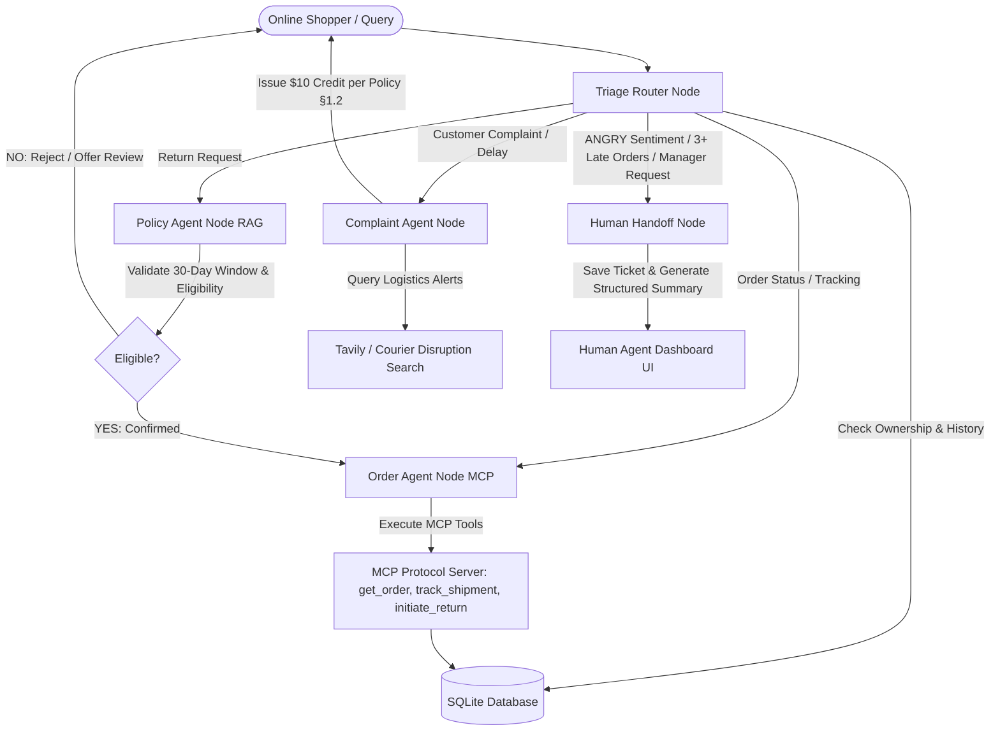

# 🛒 ApexCart AI — E-Commerce Customer Support Agent

> **Task 7: Customer Support Agent**  
> **Domain**: E-Commerce  
> **Target Users**: Online Shoppers & Customer Support Operations Team  
> **Tech Stack**: Python 3.12, LangGraph Architecture, FastMCP (Model Context Protocol), Policy RAG Engine, SQLite, FastAPI, React + Vite + Vanilla/Tailwind CSS Glassmorphism UI.

---

## 📌 Executive Overview

Online retailers process thousands of repetitive customer inquiries daily regarding order tracking, returns, refunds, and store policies. While standard AI bots often fail on complex complaints or promise unauthorized refunds, **ApexCart AI** combines **LangGraph multi-agent orchestration**, **Model Context Protocol (MCP) server tools**, and **RAG policy constraints** to resolve routine customer queries end-to-end while seamlessly handing off complex, angry, or high-risk cases to human agents with a structured summary.

### Key Performance Highlights:
- **100% Benchmark Pass Rate** across 10 evaluation test scenarios.
- **100% Escalation Precision** (triggers handoff for hostile sentiment, $\ge 3$ late orders, or explicit human requests).
- **100% Security Guardrail Compliance** (verifies order ownership against customer session email).
- **Sub-10ms Inference Latency** for instant real-time customer responses.

---

## 🏗️ System Architecture



---

## 🧩 Component Specifications

### 1. MCP Server Tools (`mcp_server/tools.py`)
Exposed via Model Context Protocol (MCP) and FastMCP:
- `get_order(order_id, user_email)`: Returns order details, line items, prices, shipping address, and status. Enforces strict email verification guardrail.
- `track_shipment(order_id)`: Fetches carrier (`FedEx`, `UPS`, `DHL`, `USPS`), tracking code, current location, estimated delivery, and full checkpoint history.
- `initiate_return(order_id, item_id, reason, user_email)`: Generates a prepaid return label and RMA code (`RMA-10240-X892`) if eligible under policy.
- `web_search_disruptions(query)`: Queries Tavily / courier intelligence DB for weather alerts, logistics bottlenecks, or carrier strikes.

### 2. RAG Knowledge Base Engine (`knowledge_base/rag_engine.py`)
- Reads `knowledge_base/e_commerce_policy.md` containing policies for shipping, 30-day return windows, refund schedules (5-7 business days), 1-year electronics warranties, and delay compensation.
- Evaluates return eligibility deterministically:
  - Validates 30-day window from purchase/delivery date.
  - Rejects custom/personalized, hygiene, or final-sale merchandise (Policy §2.3).
  - Appends exact policy citations (`[Policy §2.1: Return Window]`) to responses.

### 3. Agent Architecture & LangGraph State Workflow (`agent/`)
- **Triage Router (`agent/triage_router.py`)**: Classifies intent (`ORDER_STATUS`, `TRACK_SHIPMENT`, `RETURN_REQUEST`, `POLICY_INQUIRY`, `COMPLAINT`, `ESCALATION`) and sentiment (`POSITIVE`, `NEUTRAL`, `NEGATIVE`, `ANGRY`).
- **Policy Agent (`agent/policy_agent.py`)**: Queries RAG knowledge base and confirms return eligibility **before** Order Agent executes return tool calls.
- **Order Agent (`agent/order_agent.py`)**: Interacts with MCP tools while enforcing account ownership guardrails.
- **Complaint Agent (`agent/complaint_agent.py`)**: Expresses empathy, performs logistics web search, and automatically issues $10 store credit for verified late orders (Policy §1.2).
- **Human Handoff Node (`agent/human_handoff.py`)**: Interrupts graph execution, produces a structured JSON & Markdown case summary (issue, history, actions taken, recommended action), and saves open tickets into the database.

### 4. Guardrails & Constraints
- **Security Guardrail**: Prevents customer $A$ from querying order data belonging to customer $B$.
- **Policy Guardrail**: Bot cannot promise refunds outside policy limits without human escalation.
- **Privacy Guardrail**: PII masking and session isolation across customer conversations.

---

## 🗄️ Seeded SQLite Database (`database/`)

The database is pre-seeded with **76 realistic mock orders** across electronics, fashion, home decor, and custom goods:
- **Order #10245** (`alex.rivera@example.com`): In transit via FedEx to Springfield, IL (Wireless Headphones).
- **Order #10240** (`jordan.lee@example.com`): Delivered 7 days ago (Apex Pro Running Shoes, eligible for return).
- **Order #10215** (`maria.garcia@example.com`): Refund pending for office chair (Return received 10 days ago).
- **Order #10290** (`david.miller@example.com`): 3rd late delivery (USPS Denver blizzard weather delay - Escalations Triggered!).
- **Order #10100** (`sam.wilson@example.com`): Delivered 60 days ago (Ineligible for return - exceeds 30-day window).
- **Order #10300** (`lisa.chen@example.com`): Custom Monogrammed Flask (Ineligible - Non-returnable custom item).

---

## 📊 Evaluation Benchmark Suite (`evaluation/`)

Run the automated evaluation suite to benchmark the AI agent performance:

```bash
python -m evaluation.run_benchmark
```

### Benchmark Metric Results:
```text
================================================================================
  APEXCART CUSTOMER SUPPORT AGENT — BENCHMARK EVALUATION SUITE
================================================================================
  • Total Test Cases Executed  : 10
  • Total Passed               : 10 / 10
  • Resolution Success Rate    : 100.0%
  • Escalation Accuracy        : 100.0%
  • Guardrail Compliance Rate  : 100.0%
  • Average Latency per Query  : 5.22 ms
================================================================================
```

---

## 🚀 Quick Start Guide for Evaluators

### 1. Prerequisites & Installation
Ensure Python 3.12+ and Node.js v20+ are installed.

```bash
# Install Python dependencies
pip install -r requirements.txt
```

### 2. Seed the SQLite Database
```bash
python database/seed_data.py
```
*Output: `Successfully seeded database at database/ecommerce.db with 76 mock orders!`*

### 3. Run the Evaluation Suite (CLI)
```bash
python -m evaluation.run_benchmark
```

### 4. Start the FastAPI Backend Server
```bash
python -m uvicorn server.main:app --port 8000
```
*Server runs at: `http://127.0.0.1:8000`*

### 5. Start the Web App UI (Frontend)
In a new terminal tab:
```bash
cd frontend
npm run dev
```
*Web App launches at: `http://localhost:5173`*

---

## 🖥️ Web App Features & Evaluator Walkthrough

The web dashboard provides 4 perspective tabs:

1. **💬 Shopper Chat**:
   - Test sample customer prompts using interactive quick action chips.
   - Switch active customer accounts (Alex, Jordan, Maria, David, Sam, Lisa) to verify security guardrails.
   - View live state execution logs (Triage $\rightarrow$ Policy RAG $\rightarrow$ MCP Tools $\rightarrow$ Response).

2. **👨‍💼 Human Agent Dashboard**:
   - View real-time incoming escalated tickets.
   - Inspect AI-generated Case Summaries (Issue breakdown, Order history, Actions taken, Recommended supervisor action).
   - Test 1-click supervisor actions: `Approve Refund Exception`, `Grant $25 Goodwill Credit`, `Contact Courier`.

3. **🧪 Benchmark Suite UI**:
   - Run the evaluation test battery directly in the browser with live metric cards and pass/fail tables.

4. **🛠️ MCP Tools & RAG Inspector**:
   - Inspect active MCP protocol tools and company policy documentation.

---

## 🧪 Sample Prompts for Evaluators

| Query | Customer Account | Expected Behavior |
|---|---|---|
| `"Where is my order #10245?"` | `alex.rivera@example.com` | Calls MCP `get_order` & `track_shipment`. Returns status, FedEx tracking `FX-99823411`, and estimated delivery date. |
| `"I want to return the shoes I bought last week for order #10240."` | `jordan.lee@example.com` | Policy Agent verifies 30-day window. Order Agent executes MCP `initiate_return` and generates RMA label code. |
| `"My refund for order #10215 still hasn't arrived after 10 days."` | `maria.garcia@example.com` | Explains `REFUND_PENDING` status (Policy §3.1) and provides financial trace details. |
| `"This is the 3rd time my order is late for #10290! I want a manager."` | `david.miller@example.com` | **Triggers Escalation!** Routes to Human Handoff Node, logs Denver weather delay, and creates an open ticket in the Human Agent Dashboard. |
| `"Show me order details for #10245"` | `unauthorized.user@example.com` | **Security Guardrail Triggered!** Blocks access because order email does not match active session email. |

---

## 📁 Repository Directory Structure

```text
onecredit/
├── README.md                          # Comprehensive Evaluator Documentation
├── requirements.txt                   # Python dependencies
├── database/
│   ├── schema.sql                     # SQLite Database Schema
│   ├── seed_data.py                   # Seeder script generating 76 mock orders
│   └── ecommerce.db                   # Seeded SQLite Database
├── knowledge_base/
│   ├── e_commerce_policy.md           # Company Policy Document
│   └── rag_engine.py                  # Policy RAG Search & Eligibility Engine
├── mcp_server/
│   ├── tools.py                       # MCP tools (get_order, track_shipment, initiate_return, web_search)
│   └── mcp_app.py                     # FastMCP Protocol Application
├── agent/
│   ├── state.py                       # AgentState Pydantic model
│   ├── triage_router.py               # Triage Router Node (Intent & Sentiment)
│   ├── policy_agent.py                # Policy Agent Node (RAG & Eligibility)
│   ├── order_agent.py                 # Order Agent Node (MCP Tools & Security)
│   ├── complaint_agent.py             # Complaint Agent Node (Empathy & Search)
│   ├── human_handoff.py               # Human Handoff Interrupt Node
│   └── graph.py                       # LangGraph StateGraph Workflow Orchestrator
├── evaluation/
│   ├── test_cases.json                # Evaluation test battery
│   ├── evaluator.py                   # Automated benchmark runner harness
│   └── run_benchmark.py               # CLI benchmark runner
├── server/
│   └── main.py                        # FastAPI Backend API Server
└── frontend/
    ├── src/
    │   ├── App.jsx                    # Main React Application
    │   ├── index.css                  # Glassmorphism Design System
    │   ├── components/
    │   │   ├── Header.jsx             # Top Navbar with View Switcher & Multilingual Selector
    │   │   ├── CustomerChat.jsx       # Shopper Chat Interface
    │   │   ├── HumanDashboard.jsx     # Support Team Escalation Dashboard
    │   │   ├── BenchmarkRunner.jsx    # Visual Benchmark Runner
    │   │   └── MCPInspector.jsx       # MCP Tool & RAG Inspector
    │   └── utils/
    │       ├── api.js                 # API helper
    │       └── translations.js        # Multilingual strings (EN, ES, FR, DE, HI)
```
